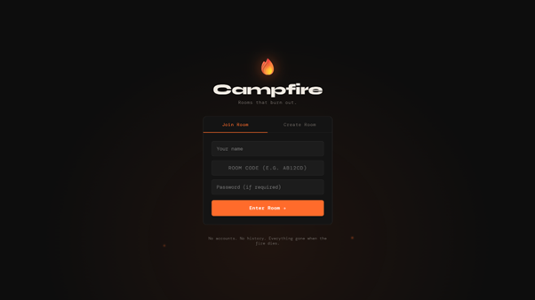
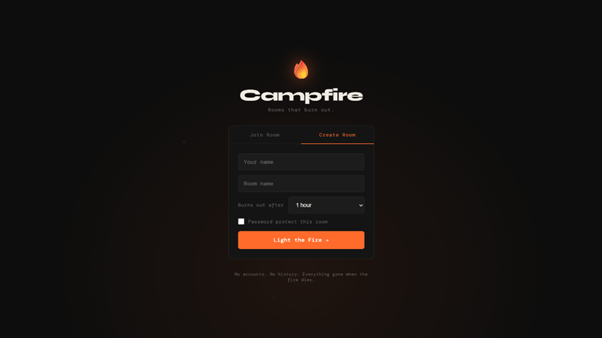
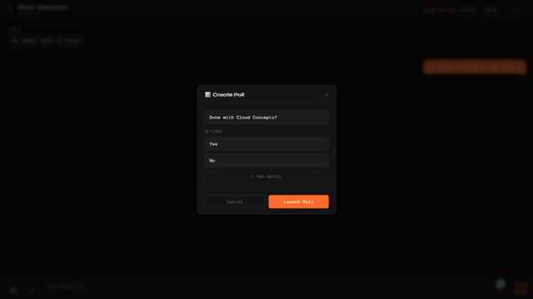
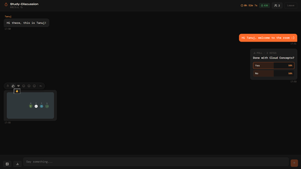
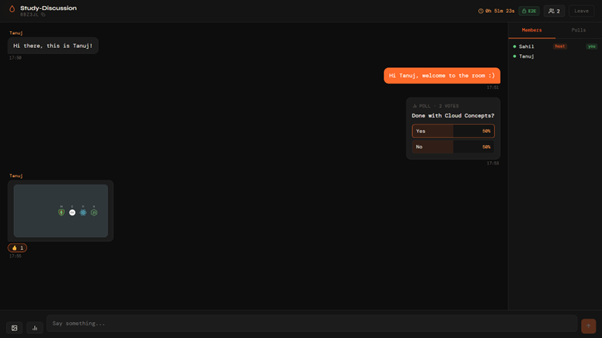

<div align="center">


# Campfire

### Rooms that burn out.

Anonymous ephemeral chat rooms — create a room, share the code, talk in real-time.  
When everyone leaves, the room is gone. No accounts. No history. No trace.

<br/>


<br/>


<br/>

[](https://anonymous-chat-mu.vercel.app)

</div>

---

## Features

| Feature | Description |
|---|---|
| E2E Encryption | Messages encrypted with AES-GCM 256-bit via Web Crypto API. Server never sees plaintext. |
| Real-time Chat | Instant messaging powered by Socket.io WebSockets |
| Ephemeral Rooms | Rooms auto-delete when the timer expires or all members leave |
| Anonymous | No signup, no accounts — just a name and a room code |
| Markdown Support | Bold, italic, underline, inline code, and code blocks with syntax highlighting |
| Message Editing | Edit your own messages with "edited" tag |
| Message Search | Search messages with Ctrl+F, navigate results with arrows |
| Live Polls | Create polls inside rooms with real-time vote updates |
| Reactions | React to messages with 6 emoji reactions |
| Reply Threading | Quote and reply to specific messages, click to jump to original |
| Pin Messages | Host can pin important messages to top ribbon |
| Mentions | Type @ to autocomplete member names with dropdown |
| Image Sharing | Drag & drop, paste (Ctrl+V), or upload multiple images with preview |
| File Sharing | Share PDFs, documents, and files up to 10MB |
| Typing Indicators | See when others are typing in real-time |
| Toast Notifications | Join/leave/copy alerts with subtle sound notifications |
| Delete Messages | Delete your own messages for everyone |
| Admin Controls | Host can kick users from the room |
| Export Chat | Export chat history as JSON or TXT before room expires |
| Password Rooms | Optional password protection for private rooms |
| Copy Room Code | One-click copy with toast confirmation |
| Share Link | Shareable direct room link with pre-filled code |
| Mobile Responsive | Works on all screen sizes |

---

## Tech Stack

**Frontend**
- React 18 — UI framework
- Vite — Build tool
- React Router v6 — Client-side routing
- Socket.io Client — Real-time communication
- Web Crypto API — AES-GCM encryption (built-in browser API, no dependencies)
- Axios — HTTP client
- React Markdown — Markdown rendering with GFM support
- Rehype Highlight — Syntax highlighting for code blocks

**Backend**
- Node.js + Express — REST API server
- Socket.io — WebSocket server
- Mongoose — MongoDB ODM
- Multer — File uploads
- Cloudinary — Cloud storage for images and files
- UUID — Room code generation

**Database**
- MongoDB Atlas — Cloud NoSQL database with TTL indexes for auto-expiring rooms
- Cloudinary — Cloud image and file storage for shared images

---

## Project Structure

```
Anonymous-Chat/
├── server/
│   ├── models/
│   │   └── Room.js             # MongoDB schema (rooms, messages, polls, pinned)
│   ├── routes/
│   │   └── rooms.js            # REST API routes (create, join, upload)
│   ├── socket/
│   │   └── handler.js          # Socket.io events (messages, reactions, pins, kicks)
│   ├── index.js                # Server entry point
│   └── package.json
│
└── client/
    └── src/
        ├── components/
        │   ├── MessageBubble.jsx    # Chat message with reactions, reply, edit, pin
        │   ├── PollCard.jsx         # Poll display with live vote bars
        │   ├── PollModal.jsx        # Poll creation modal
        │   ├── Toast.jsx            # Toast notification system
        │   ├── TypingIndicator.jsx  # Animated typing indicator
        │   ├── ImagePreview.jsx     # Multi-image preview with navigation
        │   ├── EditModal.jsx        # Message editing modal
        │   ├── SearchBar.jsx        # Message search with navigation
        │   ├── PinnedMessagesBar.jsx # Pinned messages ribbon
        │   └── MentionDropdown.jsx  # @mention autocomplete
        ├── hooks/
        │   ├── useCrypto.js         # AES-GCM encryption utilities
        │   ├── useSocket.js         # Socket.io connection hook
        │   └── useToast.js          # Toast state management
        ├── pages/
        │   ├── Home.jsx             # Create / Join room page
        │   └── Room.jsx             # Main chat room
        └── App.jsx                  # Router setup
```

---

## Key Features Explained

### Drag & Drop / Paste Images
- Drag images from desktop directly into chat
- Copy image (Ctrl+C) and paste (Ctrl+V) in chat
- Select multiple images at once
- Preview modal with navigation before sending

### Markdown & Code
- Use `**bold**`, `*italic*`, `<u>underline</u>`
- Inline code with backticks: `` `code` ``
- Code blocks with syntax highlighting using triple backticks
- Supports GitHub Flavored Markdown

### Message Management
- Edit your own messages (shows "edited" tag)
- Delete messages for everyone
- Search messages with Ctrl+F
- Click reply context to jump to original message

### Pinned Messages
- Host can pin important messages
- Pinned messages appear in top ribbon
- Navigate multiple pinned messages with arrows
- Click pinned message to jump to it in chat

### Mentions
- Type @ to see member list dropdown
- Filter by typing name after @
- Use arrow keys to navigate, Enter to select
- Mentions highlighted in messages

### Admin Controls
- Host can kick users from room
- Kicked users see notification and redirect
- Host can pin/unpin messages
- Export chat history before room expires

### File Sharing
- Upload images, PDFs, documents, ZIP files
- Files up to 10MB supported
- Stored in Cloudinary (auto-delete with room)
- Click file messages to download

---

## Running Locally

**Prerequisites:** Node.js v18+, MongoDB local or Atlas URI

```bash
git clone https://github.com/noneedofthat/anonymous-chat.git
cd anonymous-chat
```

**Server**

```bash
cd server
npm install
```

Create `server/.env`:

```env
PORT=5000
MONGO_URI=mongodb://localhost:27017/campfire
CLIENT_URL=http://localhost:5173
```

```bash
npm run dev
```

**Client**

```bash
cd client
npm install
npm run dev
```

Client runs on `http://localhost:5173`, server on `http://localhost:5000`.

---

## Deployment

| Service | Purpose | Free Tier |
|---|---|---|
| MongoDB Atlas | Database | 512MB free |
| Railway | Backend hosting | $5 credit/month |
| Vercel | Frontend hosting | Unlimited free |
| Cloudinary | Image storage | 25GB free |

**Railway (Backend) environment variables:**
```
PORT=5000
MONGO_URI=your_atlas_connection_string
CLIENT_URL=https://your-app.vercel.app
CLOUDINARY_CLOUD_NAME=your_cloud_name
CLOUDINARY_API_KEY=your_api_key
CLOUDINARY_API_SECRET=your_api_secret
```

**Vercel (Frontend) environment variables:**
```
VITE_SERVER_URL=https://your-backend.up.railway.app
```

---

## How Encryption Works

1. On joining a room, your browser derives an AES-GCM 256-bit key from the room code using PBKDF2 (100,000 iterations)
2. Every message is encrypted with a random IV before being sent
3. The server stores and relays only ciphertext — it cannot read messages
4. Messages are decrypted locally in your browser using the same derived key
5. The `E2E` badge in the header confirms encryption is active

### What IS Encrypted

- **Text messages**: All chat messages are encrypted end-to-end
- **Edited messages**: Re-encrypted when edited
- **Reply context**: The quoted text in replies is encrypted

### What is NOT Encrypted

- **Images and files**: Stored in Cloudinary as plaintext (visible to Cloudinary)
- **Polls**: Poll questions, options, and votes are sent as plaintext
- **Metadata**: Sender names, timestamps, reactions, member lists are visible to the server
- **Room information**: Room name, code, host, creation time are stored in plaintext

### Security Considerations

Since the encryption key is derived from the room code, **anyone with the room code can decrypt messages**. This is suitable for temporary, ephemeral conversations but not for high-security communications.

For stronger security, asymmetric encryption with per-user key pairs would be required, which is beyond the scope of this project.

The server operator (Railway/MongoDB Atlas) can see:
- Who is in which room
- When messages are sent
- File uploads and poll data
- All metadata except message content

---

## How Rooms Work

- Rooms are created with a random 6-character alphanumeric code
- Rooms have a TTL (time-to-live) set at creation: 1h, 6h, 12h, 24h, or 48h
- MongoDB TTL indexes automatically delete expired rooms
- If all members leave, the room is deleted after an 8-second grace period
- Attempting to join a deleted room returns: *"This room doesn't exist or has already shut down."*

---

## Screenshots

| Join Room | Create Room |
|---|---|
|  |  |

| Poll | Image & Reactions |
|---|---|
|  |  |

<div align="center">


*Members list view*

</div>

---

## License

MIT © 2026 — Built as a Full Stack Development mini project for B.Tech Computer Engineering, Semester 6.

---

<div align="center">
  <sub>Built with the MERN stack</sub>
</div>
